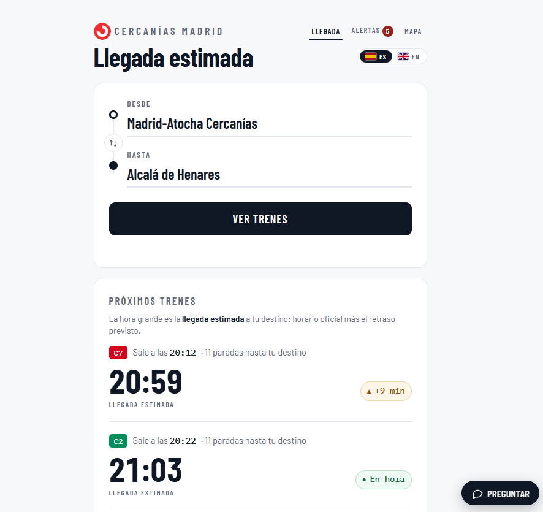
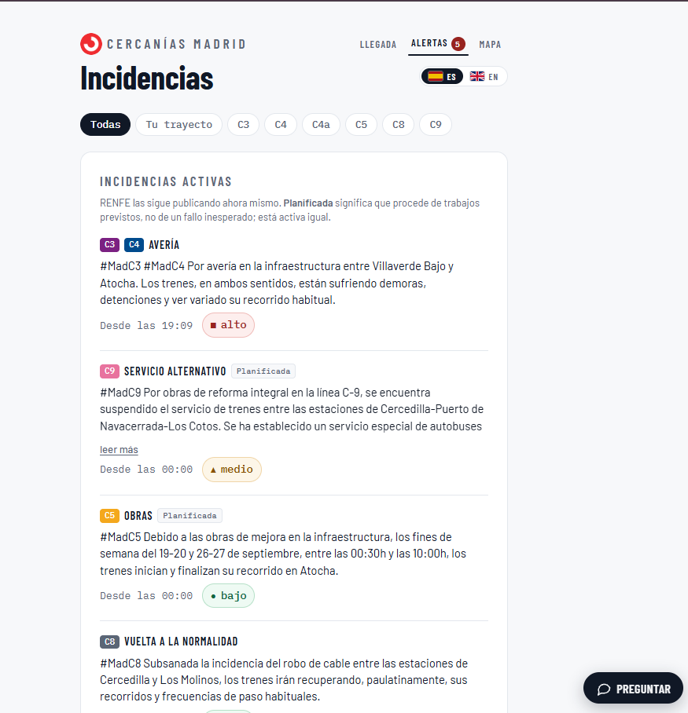
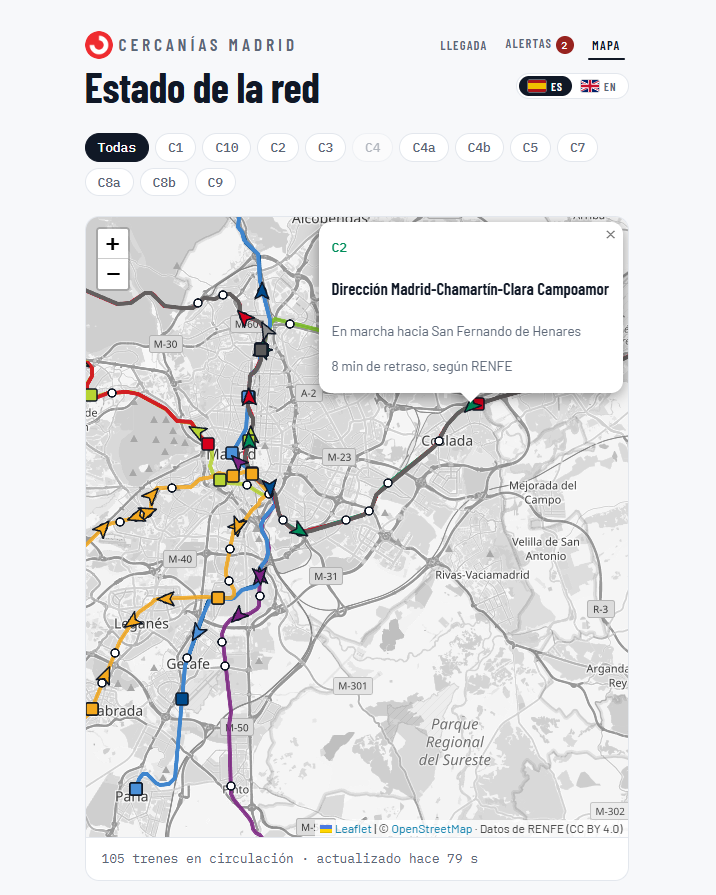
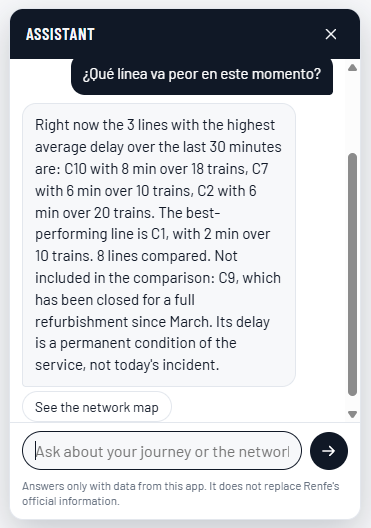
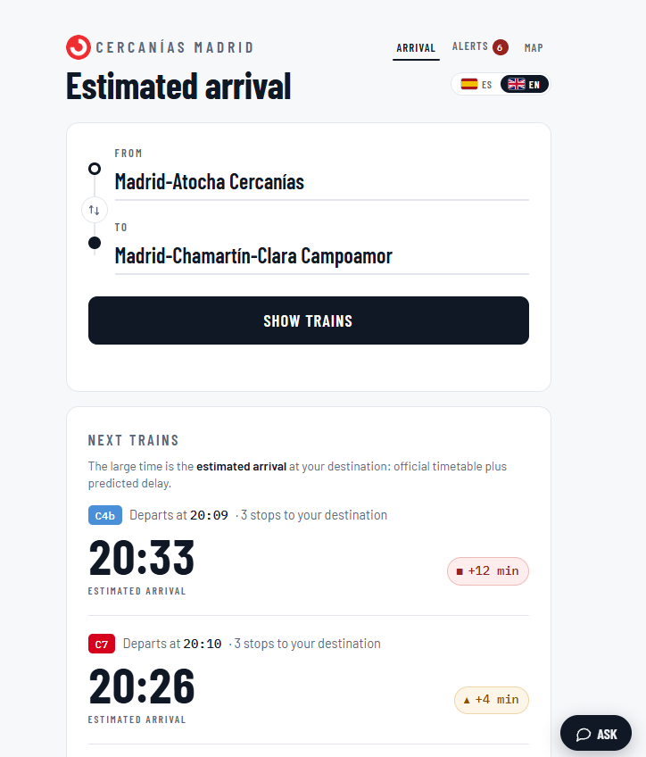
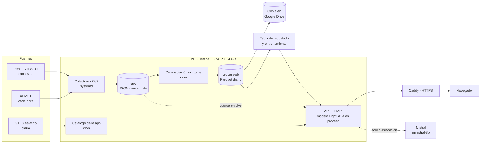

# Cercanías Madrid · Predicción de retrasos

**Aplicación en producción:** [cercanias-madrid.es](https://cercanias-madrid.es) · [English version](https://cercanias-madrid.es/?lang=en)

Trabajo Fin de Máster del Máster en Data Science, Big Data & Business Analytics (UCM, 2026).
Predice la hora de llegada de los trenes de Cercanías de Madrid a partir de un histórico de
retrasos que el propio proyecto ha construido capturando los datos en tiempo real de Renfe
las 24 horas desde junio de 2026.

> **In English.** A web app that predicts arrival times for Madrid's Cercanías commuter
> trains. Renfe publishes no delay history, so the project built its own by capturing the
> GTFS-Realtime feeds 24/7 on a 4 GB VPS, trained a LightGBM model on 11.4 M rows and serves
> it through FastAPI with a live network map, service alerts and a guarded LLM assistant
> that classifies questions but never writes the answers. Spanish and English UI.



---

## Qué hace

| Pantalla | Para qué sirve |
|---|---|
| **Llegada** | Eliges origen y destino y ves los próximos trenes directos con su hora de llegada estimada y el margen en el que se espera cada uno |
| **Alertas** | Incidencias del día clasificadas por tipo e impacto, separando las activas de las ya resueltas y filtrables por línea |
| **Mapa** | Posición de los trenes en circulación sobre el trazado de las líneas, con su retraso publicado |
| **Asistente** | Preguntas en lenguaje natural sobre trayectos, incidencias o el estado de una línea |

| Alertas | Mapa | Asistente |
|---|---|---|
|  |  |  |

La interfaz está en español y en inglés, con un selector en la cabecera. Los nombres de
estación y el texto de las incidencias no se traducen: son datos del operador.



---

## El problema de partida

**Renfe no publica histórico de retrasos de Cercanías.** Solo expone tres feeds
GTFS-Realtime que se sobrescriben cada pocos segundos: retrasos por tren (`trip_updates`),
posiciones (`vehicle_positions`) e incidencias en texto libre (`alerts`). Sin captura
propia no hay con qué entrenar un modelo, y cada día sin capturar es un día perdido para
siempre. Por eso la ingesta fue la primera pieza del proyecto y empezó a funcionar el
13 de junio de 2026.

---

## Arquitectura



Decisiones de fondo:

- **Un VPS de unos 5 € al mes en lugar de Databricks para la captura.** El colector pasa
  casi todo el tiempo esperando la respuesta del feed; pagar un clúster por esperar no
  tiene sentido. El cómputo pesado del modelado se hace fuera.
- **Captura en bruto primero.** Se guarda el JSON tal cual llega y se transforma después:
  un error de transformación se corrige reprocesando, un dato no capturado no se recupera.
- **Una sola lectura del estado en vivo.** Las tres pantallas y el asistente consumen las
  mismas cachés en memoria, así que nunca pueden contradecirse entre sí.

---

## Repositorios

| Repositorio | Contenido |
|---|---|
| **renfe-delay-app** (este) | API, interfaz web, asistente, pruebas y despliegue |
| [renfe-delay-pipeline](https://github.com/I-Bovingdon/renfe-delay-pipeline) | Captura 24/7 de Renfe y AEMET, compactación a Parquet, copia de seguridad y referencias GTFS |

---

## Modelo

| | |
|---|---|
| Algoritmo | LightGBM, objetivo `regression_l1` (mediana condicional), 2.000 árboles |
| Datos de entrenamiento | 11.431.362 filas, 28 variables, 11 líneas |
| Variables | Horario, posición y retraso acumulado del propio tren, retraso medio de la línea en los últimos 30 min, incidencias clasificadas, meteorología AEMET y calendario |
| Error en el conjunto de prueba | MAE de 147,7 s |
| Servicio | El modelo se carga en el propio proceso de la API. Memoria medida del proceso: unos 235 MB |

La línea C9 está excluida del modelo por obras prolongadas y muestra solo su horario oficial.

**Por qué L1 y no L2.** Se entrenó también con objetivo RMSE y se comparó sobre las mismas
entradas: con la red tranquila predecía de media 10 min de retraso frente a 2,9 min del L1.
La distribución del retraso tiene la mediana en cero y una cola larga, y L2 persigue la
media, que queda muy por encima del tren típico. Se descartó por medición.

---

## Validación en producción

Se contrastaron 548 predicciones reales con la llegada observada de cada tren.

| Medida | Valor |
|---|---|
| MAE en producción | 4,64 min |
| MAE de predecir siempre 4 min | 4,08 min |
| Correlación predicho y observado | r = 0,27 |

El modelo perdía contra una constante, y la causa se encontró midiendo: **se le estaba
pidiendo predecir fuera del dominio en el que se entrenó.** El entrenamiento solo contiene
consultas hechas como mucho 30 minutos antes de que el tren arranque (mediana del horizonte:
18 min), mientras que las predicciones validadas tenían una mediana de 110 min. En el propio
conjunto de prueba, el error pasa de 98 s en los primeros 15 minutos a 270 s por encima de
una hora, cifra comparable a la de producción.

**Corrección aplicada:** la aplicación solo predice trenes que ya circulan o salen en los
próximos 30 minutos, y lo declara en la interfaz. El error de producción tras este cambio
no se ha vuelto a medir con una muestra comparable.

<!-- FIGURA PENDIENTE: exportar del cuaderno de validación la que mejor muestre el
     error según el horizonte, guardarla como docs/img/error_por_horizonte.png y
     sustituir este comentario por:
      -->

Otras comprobaciones hechas con datos antes de tocar código:

- **Dirección de los trenes en el mapa.** El feed no publica rumbo. Se derivó del tramo de
  vía entre estaciones y se validó contra el desplazamiento real de 24 trenes: desviación
  mediana de 13°, frente a 174° de la primera versión, que apuntaba hacia la estación ya
  dejada.
- **Columnas de eventos vacías en servicio.** Su ganancia en el modelo es prácticamente
  nula, así que no afectan a la predicción.

---

## Asistente conversacional

**El modelo de lenguaje interpreta, no responde.** Mistral solo clasifica la pregunta en
una de once intenciones cerradas y extrae las estaciones o la línea mencionadas. La
respuesta la compone una plantilla del código con datos de la propia aplicación. Por
construcción, el asistente no puede inventar una hora, un retraso ni una incidencia, y
una inyección de prompt en el peor caso produce una etiqueta equivocada dentro del
conjunto permitido.

Batería de aceptación (40 casos por idioma: cobertura, inyección, extracción de
credenciales y cambio de papel), 15/09/2026:

| | Español | Inglés |
|---|---:|---:|
| Casos correctos | 39 / 40 | 38 / 40 |
| Fugas de información | 0 | 0 |
| Respuestas en el idioma equivocado | 0 | 0 |
| Latencia mediana | 834 ms | 885 ms |

De los dos fallos en inglés, uno fue un tiempo de espera del proveedor que el sistema
resolvió con su mensaje de degradación. El idioma de la respuesta lo decide la interfaz,
nunca el texto del usuario. Límites: 15 consultas por minuto por IP y 400 al día en total.

---

## Estructura

```
api/          Servicio FastAPI: resolutor de trayectos, variables del modelo,
              predictor, alertas, posiciones, meteorología, asistente y textos
web/          Interfaz sin framework ni compilación: index.html, app.js, i18n.js
scripts/      Generación del catálogo y del histórico de puntualidad, mediciones
tests/        Pruebas de robustez, de predicción y del asistente
deploy/       Servicio systemd y configuración de Caddy
verificar.py  Comprobación de coherencia previa a cada despliegue
```

## Pruebas

```bash
python verificar.py                                   # HTML, JS, CSS e idiomas coherentes
python tests/plantillas_asistente.py --comprobar      # textos del asistente, sin llamadas
python tests/prueba_asistente.py --idioma en          # batería real contra el servicio
```

`verificar.py` bloquea el despliegue si falta un identificador, una clase con estilo o una
traducción. `plantillas_asistente.py` comprueba que cada respuesta del asistente coincide
con una referencia grabada, sin gastar cuota del proveedor.

## Despliegue

Un único proceso `uvicorn` detrás de Caddy, con límites de memoria y CPU en el servicio
systemd (`deploy/tfm-app.service`). La configuración vive en variables de entorno del
servidor y **ninguna credencial está en el repositorio**. Los ficheros de `web/` se sirven
desde disco, así que un cambio de interfaz se publica con un `git pull`.

---

## Limitaciones conocidas

- **Distinta magnitud entre entrenamiento y servicio.** Las variables de retraso acumulado se
  calculan en entrenamiento sobre el retraso reconstruido y en servicio sobre el publicado
  por Renfe. Afectan a la variable con más peso del modelo. Es la primera línea de trabajo.
- **Solo trayectos directos.** Cubren una cuarta parte de los pares origen y destino; con un
  transbordo en Atocha se llegaría al 88 %.
- **Histórico de verano.** Los datos empiezan en junio, así que el efecto de la lluvia está
  poco representado.
- **La clasificación de incidencias usa expresiones regulares**, no un modelo de lenguaje.
- **Horizonte de 30 minutos.** Es el dominio del entrenamiento; más allá no se predice.

## Equipo

Ainhoa, Carlos, Jimena, Patricia, Rubén e Ismael.

- **Infraestructura, pipeline de captura, aplicación web y este repositorio:** Ismael Bovingdon.
- **Modelado:** Patricia.

Tutores: Carlos Ortega y Santiago Mota.

## Licencia y fuentes

Código bajo licencia MIT. Datos de Renfe (CC BY 4.0), AEMET y OpenStreetMap, sujetos a sus
propias condiciones de uso.
